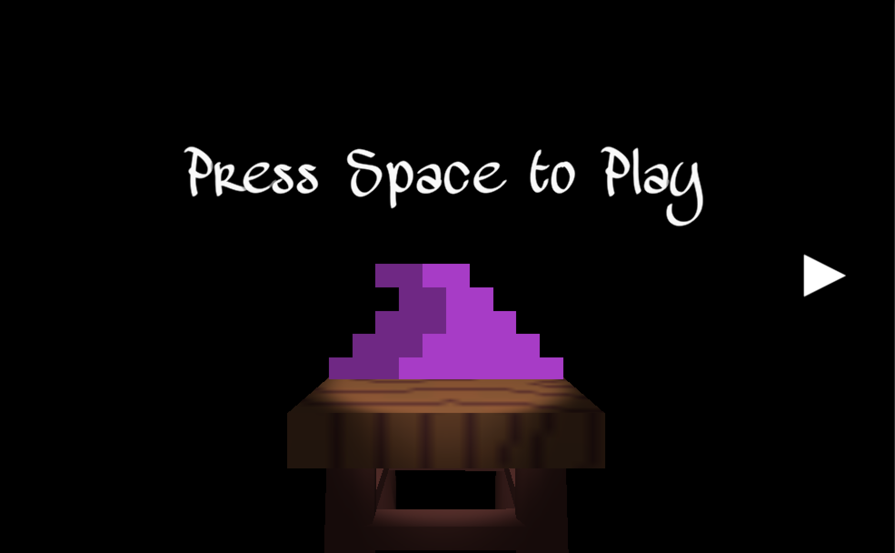

# The-Magic-Hat
This Unity game was developed as the final project for my COMP-3770 class and received a grade of 100%.  You play as a wizard named Boshi who wakes up one day to find that his magical hat has been stolen! You set out on a perilous journey to find the culprit and take back your hat. Will it be the slimes of the overworld? or the goblins of the depths? or maybe.... the 'hat stealing' dragon!

WASD/Arrow keys to move.

Space to jump

Ctrl to sprint

Z shoots a fireball (if you have the potion)

Main Menu

Level 1 (Jungle)

Level 2 (Cave)

Level 3 (Dungeon)

