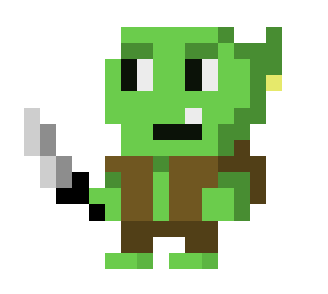
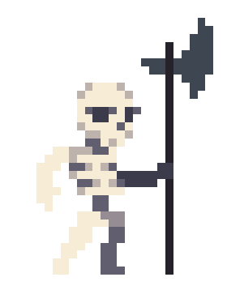

# The-Magic-Hat

<h2>Overview</h2>
This Unity game was developed as the final project for my COMP-3770 class and received a grade of 100%.  You play as a wizard named Boshi who wakes up one day to find that his magical hat has been stolen! You set out on a perilous journey to find the culprit and take back your hat. Will it be the slimes of the overworld? or the goblins of the depths? or maybe.... the 'hat stealing' dragon!

<h2>Controls</h2>
 WASD/Arrow keys to move
| Space to jump
| Ctrl to sprint
| Z shoots a fireball (if you have the potion)

Demo: 

<h2>Screenshots</h2>

The main menu of the game has 5 different screens, the first screen begins the game when the space key is hit, the following three screens are to select one of the three levels, and the last screen keeps track of the game stats. After the user hits the space key, a short cutscene is shown before launching into the first level.

<h2>Level 1 (Jungle)</h2>
The game begins in the jungle level, the main character Boshi has awoken to find that he is missing his magical hat. He immediatley begins on a journey to find who has taken it from him. This level serves as an introduction to the controls and some of the monsters that Boshi will have to fight along the way.

<h2>Level 2 (Cave)</h2>
The second level is in a dark cave with a parallax background.  There are a few more enemies introduced to Boshi as well as several new potions and collectables.  The environment is proceduraley generated and the platforms and enemies that spawn are compleley random.

<h2>Level 3 (Dungeon)</h2>
The final level of the game takes place in a dungeon and has all of the remaining enemies and powerups available to the player. Moving platforms are also a key element of this level.  Once the player reaches the end, they are presented with their hat and can finally regain their magic powers.

<h2>Enemies</h2>
<h4>Slime</h4>

The slime is the first enemy encountered by the player in the forbidden forests. He wears a fez and jumps up and down. He is easily killed by jumping on it's head and does 1 heart of damage if the player walks into him.

 
  
 <h4>Goblin</h4>

The Goblin is the second enemy encountered and has slightly more health and does an additional heart of damage if the player walks into him.  The Goblin is also killed by jumping on their head (as required by the assignment)

<h4>Flame</h4>

The flame enemy exsists in all levels of the game and can only be destroyed by a fireball cast by the player.  The flame enemy constantly expells balls of flame that hurt the player and produce a knockback effect.

  
<h4>Floating Eye</h4>

The Floating eye enemy teleports to the player and explodes after 3 seconds.  The only way to kill the floating eye is with a fireball or the laser eye powerup. The enemy is introduced in level 2 and is very tricky to kill. If the player is in range of the explosion the player experiences a knockback effect

 
<h4>Skeleton</h4>

The skeleton is the final enemy encountered by the player and continuously paces back and forth. If the player is within range of the skeleton's scythe than he will attack the wizard. He can be killed by jumping on his head.

   
